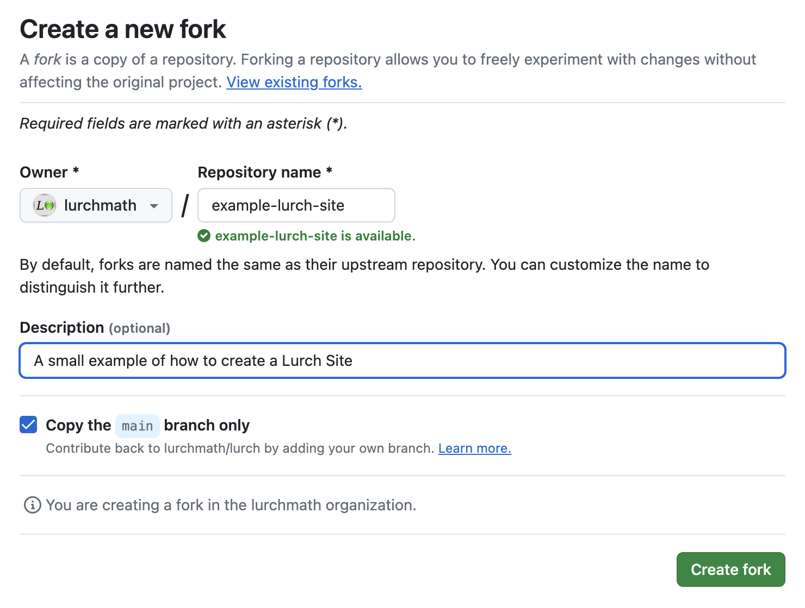
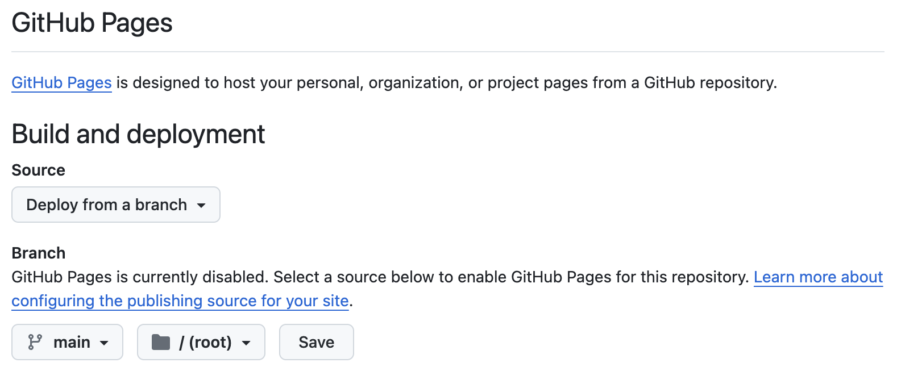
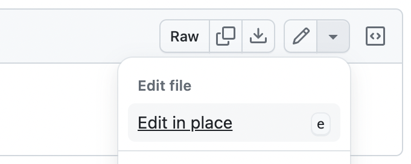
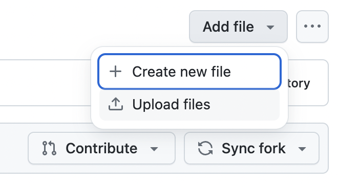

# How to create a Lurch Site

## See also

 - [What is a Lurch Site?](what-is-a-lurch-site.md)
 - [Gallery of existing Lurch Sites](lurch-sites-gallery.md)

To create your own Lurch site, follow the instructions below.

## Step 1. Fork an existing Lurch Site

To find a site you want to use as the starting point for your new site, see our
[gallery](lurch-sites-gallery.md).

Once you have selected a site, visit its GitHub repository; you can find a link
to that repository in the gallery.  For example, the Developer Site's repository
is at [`github.com/lurchmath/lurch`](http://github.com/lurchmath/lurch).

If you're new to the concept of "forking" on GitHub, see
[GitHub's forking instructions](https://docs.github.com/en/pull-requests/collaborating-with-pull-requests/working-with-forks/fork-a-repo).
You simply visit the repository you're forking, click the "Fork" menu on the top
right, choose to create a new fork, and fill out a form like the following one.

Once you have followed those instructions, you will have your own separate copy
of the Lurch Site that you forked, but it will not yet be visible on the web.

## Step 2. Enable web access

Until you do this, you cannot view your newly-created Lurch Site on the web.
Here are the steps to enable web access for your Lurch Site:

 - Visit the repository you just created in the previous step, probably named
   something like `github.com/your-github-username/your-new-fork`.
 - Click the "Settings" tab near the top of the page.
 - Click the Pages section from the left navigation bar.
 - Ensure that the "Source" menu has "Deploy from a branch" selected.
 - Ensure the "Branch" settings are for "main" and "root."
 - Click the Save button.

 - *It will take a few minutes for these changes to take effect.*
 - Then visit the website for your new fork, probably something like:

   `http://your-github-username.github.io/your-new-fork/app`
 
 - Verify that your copy of the Lurch app is live.

## Optional Step 3. Change the default configuration

You can do this step now, or later, or leave the configuration at its default.
To change the configuration for your new site:

 - View the `README.md` file in the `config/` folder of your forked repository.
   It explains the various ways you can configure the app, and all the options
   available to you.
 - Changing the configuration will require editing one or more files in the
   repository, which you can do in many ways.  Here are a few options; select
   whichever of these options seems most convenient to you.  (You need only one
   of these methods.)
    - **Recommended option:**
      Find the file you want to change in the repository on GitHub and click the
      edit button (pencil icon) on the top right.  See the screenshot below.
      Commit your changes when done.
    - Press the period (".") key while viewing your repository to open an editor
      in the browser.  Commit your changes when done.
    - Open a GitHub Codespace from the "Code" menu on GitHub and work there.
      Commit your changes when done.
    - Clone the repository to your computer and make changes there, then push
      them back to GitHub.

## Optional Step 4. Add mathematical documents

You will almost surely want to add your own mathematical documents to your site
at some point, but it is not necessary to do so immediately.

The instructions below assume that you have already written some mathematical
documents.  Perhaps you did so using the Lurch app in your new site or another
Lurch Site or perhaps you copied the files from elsewhere (with the author's
permission, of course).

Choose whichever of the following methods you prefer to upload your Lurch files
into the `math/` folder of your Lurch Site's repository.  (You need to choose
only one of these methods.)

 - **Recommended option:**
   View the `math/` folder in the repository, and click "Add file" in the top
   right, and choose "Upload files."

 - If you have the repository opened in a GitHub Codespace, you can drag the
   files into the editor's file browser (the left hand site).  Commit your
   changes.
 - If you cloned the repository to your computer, just add the files to your
   local copy, commit them, and push them to GitHub.

You may wish to verify that the files you uploaded can accessed from your Lurch
Site's copy of the Lurch app.  You can do so in two different ways:

### Method 1: Using File > Open

 - Visit the Lurch app in your Lurch Site.
 - Click the File > Open menu item.
 - In the dialog that appears, select "From the web."
 - Enter the URL to one of the files you uploaded, in the following form:

   `http://your-github-username.github.io/your-new-fork/math/your-file-name.lurch`

 - Verify that it opens successfully in the Lurch app.

### Method 2: Using a direct link

This method is useful because it allows you to create a single URL that opens a
file you've written directly in the Lurch app in your Lurch Site.  This can be
useful for sharing with students, for example, to open a homework assignment in
one click.

Let's assume you have a file named `homework-1.lurch` in the `math/` folder of
your Lurch Site repository.  Build a URL as follows, and visit it in your
browser:

`http://your-github-username.github.io/your-new-fork/app/index.html?load=/math/homework-1.lurch`

## Optional Step 5. Add/modify supporting web pages

Right now, if users try to visit
`http://your-github-username.github.io/your-new-fork`, they will get one of two
results:

 - If you forked a Lurch Site that had no landing page, the visitor will get a
   "not found" error.
 - If you forked a Lurch Site that had a landing page, the visitor will see the
   landing page from the original Lurch Site that you forked.

You may wish to create your own landing page, and possibly additional pages,
perhaps with information about a course you're teaching, or a list of Lurch
documents in your repository.  We provide an Example Lurch Site that you may
wish to imitate.  (See link below.)

Feel free to fill the root folder of your Lurch Site's repository with as many
HTML files as you like.  The one named `index.html` is the default landing page
and can link to as many others as you wish to create.

If you want any of those pages to link directly to one of the Lurch documents in
your repository's `math/` folder, opening it in your Lurch Site's copy of the
Lurch app, use the method in the previous section for building a URL that does
exactly that.  You can also imitate the links you'll find in the landing page
for the Example Lurch Site.

 - [View that landing page here](http://lurchmath.github.io/example-lurch-site)
 - [View its source code here](http://github.com/lurchmath/example-lurch-site/tree/main/index.html)
