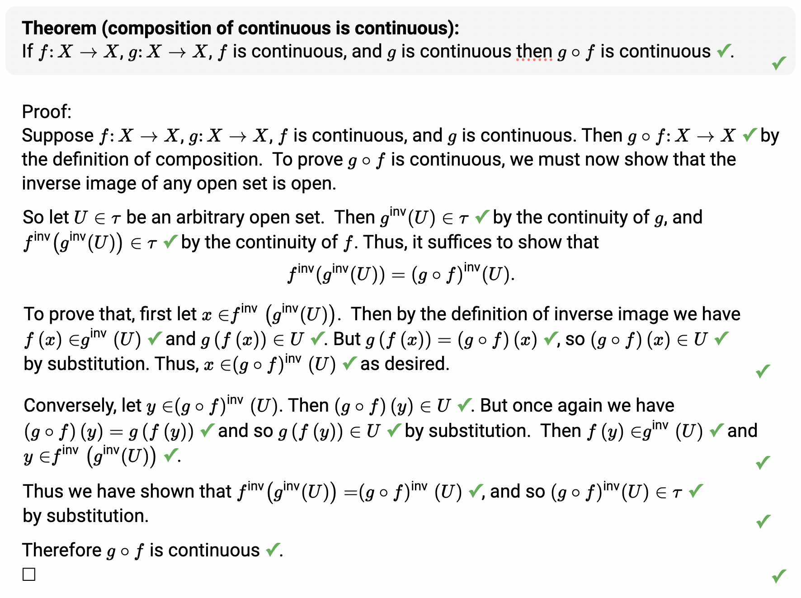
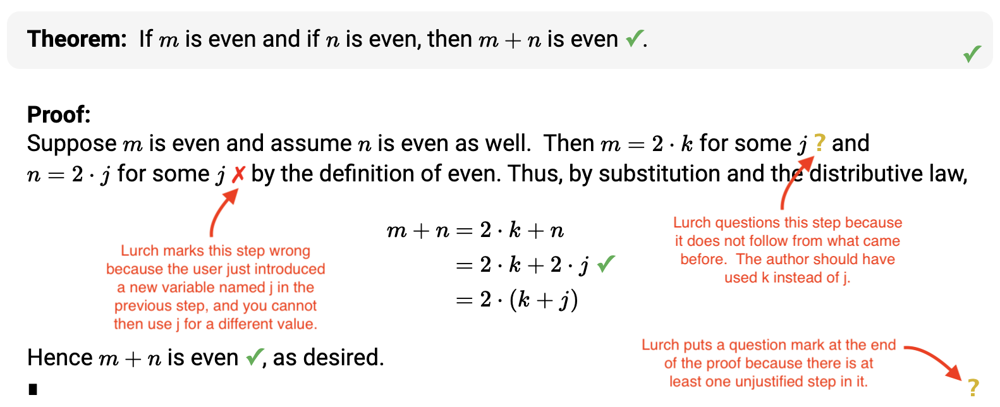

# The Lurch Project

***Lurch* is a word processor designed to check the reasoning in proofs,
specifically the types of proofs that students do in an introduction to proofs
course.**

Its purpose is to give immediate and helpful feedback about whether a student is
doing their proof correctly, so that the student learns the mechanics and rules
of proof writing more quickly and thoroughly than if they had to wait days for
manually graded feedback.

## Lurn more

We have recently overhauled our documentation, and more updates are coming soon.
Not all docs have been updated, but most have been.  New bug fixes, new
features, and new documentation arrive regularly.

[Tutorials](tutorial-toc.md)

[How-To Guides](how-to-toc.md)

[References](reference-toc.md)

[Gallery](lurch-sites-gallery.md)

## Example proof in Lurch

The green check marks show that Lurch has graded each step of this work correct.
Not shown in the picture are all the definitions of functions, sets, and
topological spaces preceding the theorem and proof.

## Lurch also finds mistakes

The following shows a proof with intentional mistakes added, to showcase Lurch's
ability to detect them.  The yellow "?" and red "X" are part of Lurch's
feedback, while the red text hovering over the document has been added for the
purposes of explaining on this website why Lurch gave the marks it gave.

In the application, if the user hovers their mouse over the yellow "?" they will
get a message saying, "You have not yet convinced me of this."  If they hover
their mouse over the red "X" they will get a message saying, "But you have
already used j."
